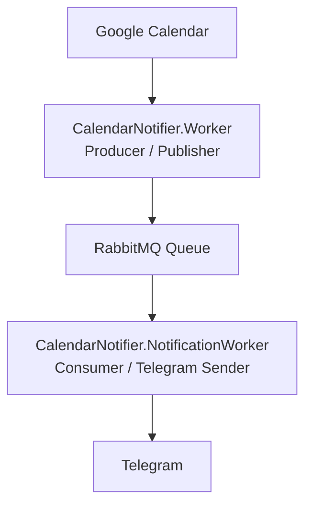

## 📅 CalendarNotifier

Uma aplicação desenvolvida em .NET com foco em aprendizado de arquitetura orientada a eventos, mensageria e integração com serviços externos.

O projeto consulta eventos do Google Calendar, publica uma mensagem em uma fila do RabbitMQ e um serviço consumidor envia as notificações para um grupo do Telegram.

O principal objetivo deste projeto é estudar conceitos utilizados em sistemas distribuídos e microsserviços de forma prática.

---

## Status do Projeto

🚧 Em desenvolvimento

### Funcionalidades implementadas

- [x] Integração com Google Calendar
- [x] Integração com Telegram
- [x] RabbitMQ (Producer/Consumer)
- [x] Retry + DLQ
- [x] Agendamento diário
- [x] Contratos compartilhados (DTO)
- [x] Docker

### Próximas funcionalidades

- [ ] Aplicação Web
- [ ] Banco de dados
- [ ] Cadastro de usuários
- [ ] Múltiplas agendas
- [ ] Múltiplos grupos Telegram
- [ ] Health Checks
- [ ] Logs estruturados
- [ ] Testes automatizados

---

## 🚀 Tecnologias
- .NET 8
- C#
- Worker Services
- RabbitMQ
- Docker
- Google Calendar API
- Telegram Bot API
- System.Text.Json

---

## 🏛 Arquitetura



A aplicação segue o padrão Producer / Consumer, onde os serviços são desacoplados através do RabbitMQ.

---

## 📦 Estrutura da solução

```mermaid
flowchart TD
CalendarNotifier 
│ 
├── CalendarNotifier.Worker 
│ ├── Consulta o Google Calendar 
│ ├── Mapeia os eventos 
│ ├── Publica mensagens no RabbitMQ 
│ └── Executa diariamente em horário configurado 
│ 
├── CalendarNotifier.NotificationWorker 
│ ├── Consome mensagens 
│ ├── Formata a mensagem 
│ └── Envia para o Telegram 
│ 
└── CalendarNotifier.Messaging 
    ├── Contratos compartilhados 
    ├── Configuração do RabbitMQ 
    ├── Topologia das filas 
    └── Constantes de mensageria
```
---

## 🔁 Fluxo da aplicação

````mermaid
GC[Google Calendar]
GS[GoogleCalendarService]
GM[CalendarNotificationMapper]
GN[CalendarNotification (DTO)]
JN[JSON]
RB[RabbitMQ]
NW[NotificationWorker]
TF[TelegramMessageFormatter]
TG[Telegram]

GC --> GS
GS --> GM
GM --> GN
GN --> JN
RB --> NW
NW --> TF
NF --> TG
````

---

## 📬 Filas RabbitMQ

O projeto utiliza três filas:

## 📬 Filas

| Fila | Responsabilidade |
|------|------------------|
| `calendar-events` | Fila principal |
| `calendar-events-retry` | Retry utilizando TTL |
| `calendar-events-dlq` | Dead Letter Queue |

O Retry é realizado utilizando TTL + Dead Letter Exchange (DLX).

---

## 📚 Conceitos estudados

Durante o desenvolvimento foram aplicados diversos conceitos importantes:

- Worker Services
- RabbitMQ
- Producer / Consumer
- Retry
- Dead Letter Queue (DLQ)
- Dead Letter Exchange (DLX)
- TTL
- Mensagens em JSON
- DTOs (Data Transfer Objects)
- Mapeamento entre modelos
- Separação de responsabilidades
- Agendamento diário
- Integração com APIs externas
- Docker

---

## ⚙️ Configuração
### RabbitMQ

O projeto utiliza RabbitMQ executando via Docker.

docker compose up -d

Painel de gerenciamento:

http://localhost:15672

Usuário: guest

Senha: guest

---

## Google Calendar

É necessário criar credenciais OAuth no Google Cloud Console e configurar a aplicação para acesso à API do Google Calendar.

Na primeira execução será solicitado o login na conta Google.

---

## Telegram

É necessário:

- Criar um Bot utilizando o BotFather
- Obter o Bot Token
- Descobrir o Chat Id do grupo

---

## 🎯 Objetivos futuros

Próximas evoluções planejadas:

Aplicação Web para configuração
Persistência em banco de dados
Cadastro de múltiplas contas Google
Cadastro de múltiplos grupos Telegram
Configuração de horários pela interface
Autenticação
Histórico de notificações
Logs estruturados
Health Checks
Testes automatizados

---

## 🎓 Objetivo do projeto

Mais do que construir uma aplicação funcional, este projeto foi desenvolvido para consolidar conhecimentos sobre arquitetura orientada a eventos, mensageria e integração entre serviços, simulando cenários encontrados em aplicações distribuídas.